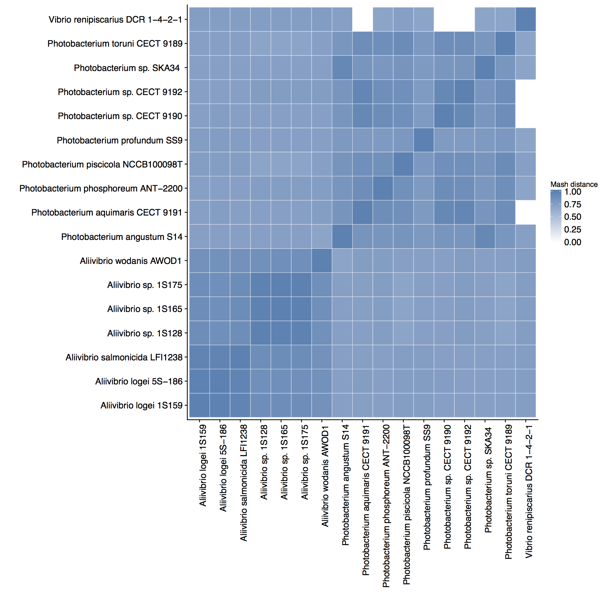
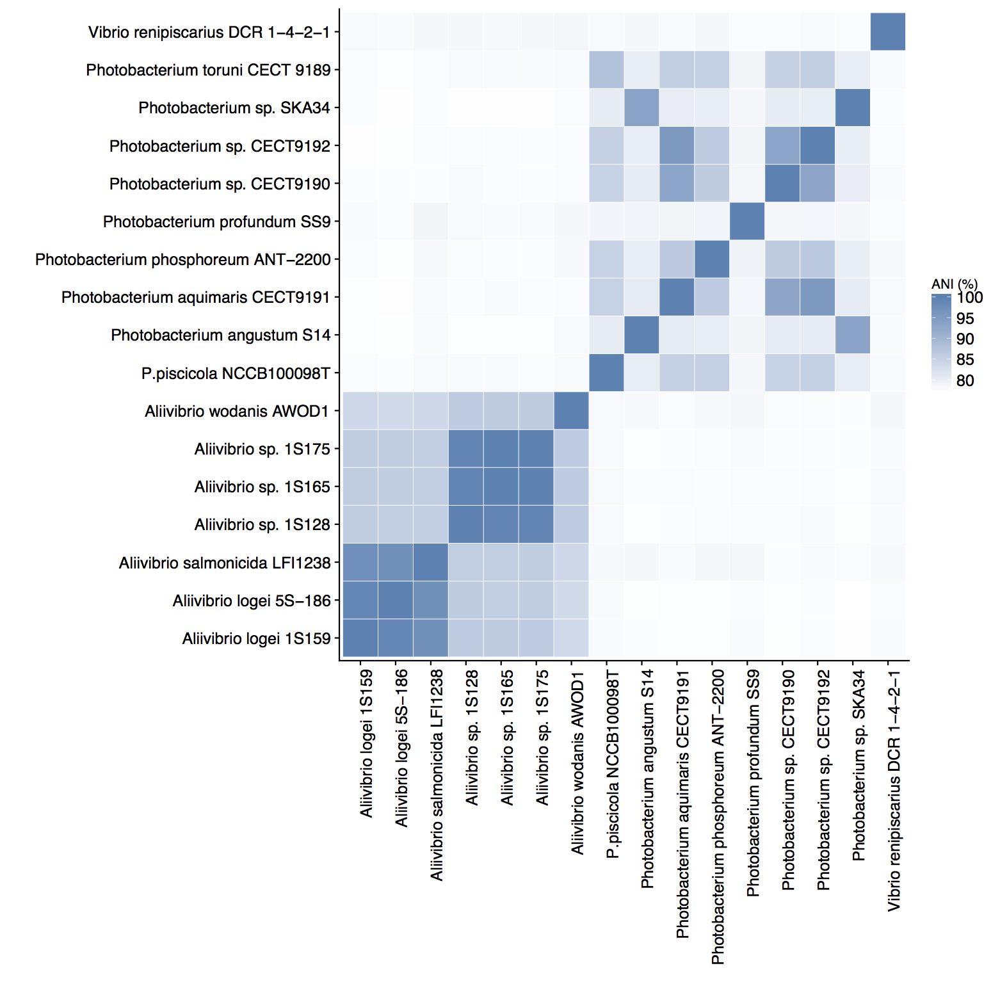
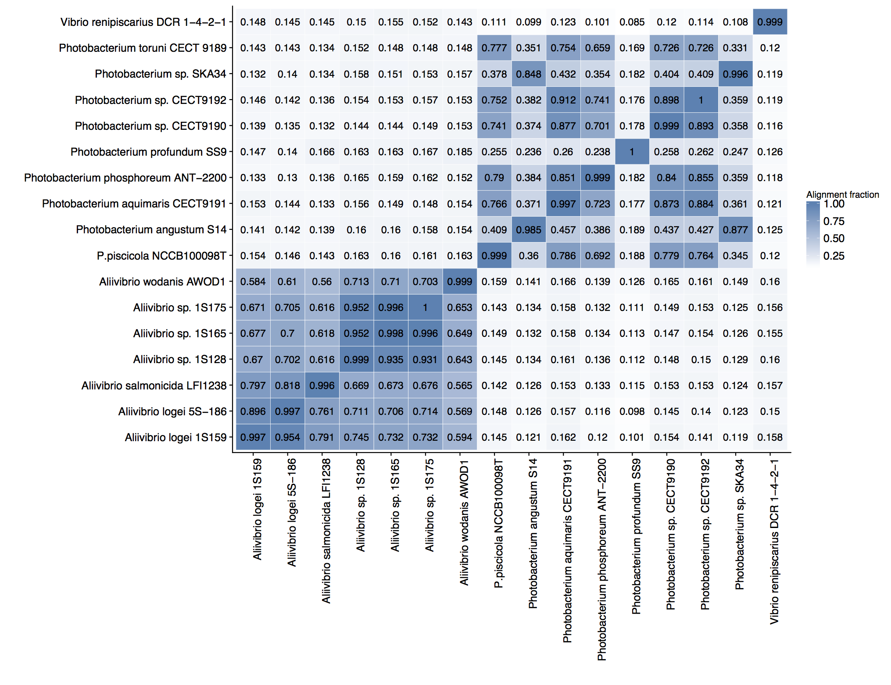

# Comparison of Vibrionales genome similarity

The metagenomics classification from the Cod gut microbiomes indicated several bacterial genomes within the order Vibrionales that recruited the most "unique reads". That is these genomes has reads mapping to them, without any other alignments elsewhere in the genomes. The regions where they mapped can be considered as the unique regions of these genomes. The question here is how, similar were these genomes at thw genome level. Very similar genomes would only recruite very few "unique reads" and vice versa for the disimilar genomes.

One method of comparing bacterial genome similarity is to calculate the Average Nucleotide Identity (ANI), which is a in silico method comparible with DNA-DNA hybridization. We use the method to build a distance matric between the genomes that recruited the reads and we then vizualize that matrix in R as a heatmap with a dendrogram.

Below I described three methods that you can use:

* [Jspecies web server](http://jspecies.ribohost.com/jspeciesws/)
* [Mash: fast genome and metagenome distance estimation using MinHash](https://genomebiology.biomedcentral.com/articles/10.1186/s13059-016-0997-x)
* [FastANI](https://github.com/ParBLiSS/FastANI)

##### Note that I am only showing the commands and results from MASH and FastANI in the section below.

## Genomes to compare

|   Genome   | Accession number | Genome Size   | GC- content |  contigs | present in JspeciesWS database | Original isolation source |
| --- | --- | --- | --- | --- | --- | --- |
*Aliivibrio salmonicida* LFI1238  | NC_011312.1 | 4,655,660 | 38.97 | 6 | YES | Norway, Hammerfest, Atlantic cod |
*Photobacterium piscicola* strain type strain W3 | NZ_FUZI01000061.1 | 4,525,300 | 39.2 | 65 | No - uploaded to server | North Sea, The Netherlands, Whiting skin |
*Aliivibrio logei* strain 1S159 1S159__0 | NZ_MAJU01000001.1 | 4,638,003 | 38.97 | 76 | Yes | USA, Massachusetts; Filtered Seawater, 1-5 micron fraction |
*Aliivibrio logei* 5S-186 5S-186__0 | NZ_AJYJ02000001.1 | 4,451,541 | 39.0 | 145 | No – uploaded to server | USA, Massachusetts; filtered seawater (5um filter) |
*Photobacterium phosphoreum* ANT-2200 | NZ_LN794352.1 | 5,091,755 | 38.88 | 3 | Yes | Northwestern Mediterranean Sea at the ANTARES neutrino-telescope site (42°54′N/06°06′E) at 2200-m depth (13°C)   |
*Aliivibrio* sp. 1S128 1S128__0 | NZ_MAJV01000001.1 | 4,320,262 | 38,6 | 189 | No – uploaded to server | USA, Massachusetts; Filtered Seawater, 1-5 micron fraction |
*Aliivibrio* sp. 1S165 1S165__0 | NZ_MAJT01000001.1 | 4,317,411 | 38.6 | 90 |  No – uploaded to server | USA, Massachusetts; Filtered Seawater, 1-5 micron fraction |
*Aliivibrio* sp. 1S175 1S175__0 | NZ_MAJS01000001.1 | 4,320,255 | 38.6 | 99 | No – uploaded to server | USA, Massachusetts; Filtered Seawater, 1-5 micron fraction |
*Photobacterium toruni* strain CECT 9189 | NZ_FUWP01000118.1 | 4,420,947 | 38.6 | 118 | No – uploaded to server | spleen samples of diseased farmed redbanded seabream (Pagrus auriga) in south-west Spain |
*Photobacterium* sp. CECT 9192 (Photobacterium andalusiense)  | NZ_FYAJ01000000.1 | 4,455,676 | 39.4 | 68 | No – uploaded to server | diseased redbanded seabream (Pagrus auriga) reared in Andalusia (Southern Spain) |
*Photobacterium aquimaris* strain type strain  CECT9191| NZ_FYAH01000000.1 | 4,306,099 | 39.5 | 53 | No – uploaded to server | diseased redbanded seabream (Pagrus auriga) reared in Andalusia (Southern Spain) |
*Aliivibrio wodanis* AWOD1  | NZ_LN554846.1 | 4,635,126 | 38.48 | 6 | Yes | Aliivibrio wodanis is one of the causative agents of winter ulcer. The disease affects both Atlantic salmon (Salmo salar) and rainbow trout (Oncorhynchus mykiss) and results in increased mortality rates as well as major economical losses due to downgrading fish at slaughter. |
*Photobacterium* sp. CECT 9190 (Photobacterium malacitanum) | NZ_FYAK01000000.1 | 4,380,538 | 39.8 | 55 | No – uploaded to server | diseased redbanded seabream (Pagrus auriga) reared in Andalusia (Southern Spain) |
*Photobacterium angustum* S14 1099604003228 | NZ_CH902605.1 | 5,181,543 | 39.1 | 25 | No – uploaded to server |  surface coastal waters in Botany Bay (Sydney), Australia |
*Photobacterium* sp. SKA34 scf_1099521381185 | NZ_CH724147.1 | 4,992,772 | 39.2 | 18 | No – uploaded to server | not described online |
*Photobacterium profundum* SS9 | NC_006370.1 | 6,403,280 | 41.73 | 3 | Yes | Deep Sea, Sulu Trough (Between Borneo and Philippines |
*Vibrio renipiscarius* strain DCR 1-4-2 1 | NZ_JTKH01000001.1 | 4,347,351 | 45.2 | 44 | No – uploaded to server | Isolated from cultured Gilthead Sea Bream (Sparus aurata) in Spanish Mediterranean fish farms |

This file contains the genomes I used, in fna format:
[genomes.tar](input_genomes/genomes.tar)
Note the genome files themselves are compressed with Gzip

## Running ANI-blast & TETRA

I uploaded all the above genomes except for: ` Photobacterium sp. SKA34 ` &  `Vibrio renipiscarius strain DCR 1-4-2 1 `. The JspeciesWS server only allows for 15 genomes to be compared and we have a list of 17.

I will run this, and when there are genomes that are almost identical I have to note that, and then redo the analysis with these two genomes included.

I then start an ANI-B run, and after that I ran the Tetra analysis.

Both showed a clear clustering of the Aliivibrio genomes (DATA NOT SHOWN)

## MASH analysis to calculate distances between genomes

Here are the commands I ran:
Building sketches in a reference database:

```
./mash sketch -o reference *.fna
```
viewing the sketches

```
./mash info reference.msh
```
And running the comparison.

```
./mash dist reference.msh *.fna | sort -k1 > vibrionales_mash_results.txt
```

That gives me a table that I have to parse.


## fastANI analysis
FastANI is a different implementation of ANI designed to process thousands of genomes.

These were the commands I wrote:

```
ls *.fna > genome_list.txt 

# fastANIls
for file in *.fna; do ./fastANI -q $file --rl genome_list.txt -o $file.ANI.txt; done
```

That worked nicely. I concatenate the output files.

## creating an R script for plot.

I imported the mash and fastANI results into R-studio and created a script to process the data and make a figure of the relationships between the genomes.

[Genome distances script.R](input_genomes/Genome_distances_script.R)

The result of this script is three figure:

### FIGURE 1 Mash output. 1-mash distance


This shows clearly that the *Vibrio* species has very little in common with the other genomes. It also shows that the *Aliivibrio *species are more similar to each other than the *Photobacterium* species.

### FIGURE 2 fastANI output. Average Nucleotide identity between the genomes.


This gives a clear seperation of the *Aliivibrio* species, and it shows some similarities among the photobacteria. But they are all independent species.

### FIGURE 3 fastANI output. Alignment fraction of genomes.


This shows the same pattern as the ANI output, but it now is overlayed with the values of the percentage of the alignment.

# Conclusion.
The reference genome used are mostly seperate species with highly divergent genomes. This is only less so for the *Aliivibrio* species


